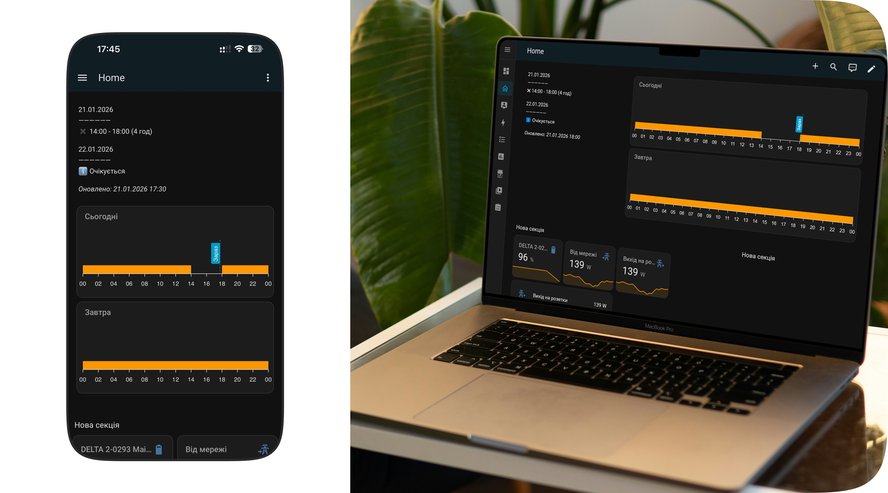

# Візуалізація графіків відключень Рівнеобленерго в Home Assistant

Дана конфігурація дозволяє створити інформативний блок на дашборді, який поєднує текстову інформацію про графіки відключень та їх візуальне представлення у вигляді часової шкали на сьогодні та завтра.

## 🛠 Необхідні компоненти

Для роботи цього блоку у вас мають бути встановлені наступні кастомні картки (через HACS):

1.  [**Layout Card**](https://github.com/thomasloven/lovelace-layout-card) (для гнучкої сітки).
2.  [**ApexCharts Card**](https://github.com/RomRider/apexcharts-card) (для побудови графіків).

## 📊 Опис функціонала

Блок розділений на дві частини:

- **Ліва частина (Markdown):** Виводить актуальний розклад у текстовому форматі, який підтягується з сенсора.
- **Права частина (Charts):** Два графіки, які автоматично визначають, де "сьогодні", а де "завтра", аналізуючи дати з сенсорів `roe_date_row5` та `roe_date_row6`.

## 📝 Код для Dashboard (YAML)

Додаємо нову секцію і редагуємо у форматі yaml:

```yaml
type: custom:layout-card
layout_type: grid
layout:
  grid-template-columns: 1fr 2fr
  grid-gap: 8px
  mediaquery:
    "(max-width: 800px)":
      grid-template-columns: 1fr
cards:
  - type: markdown
    content: |
      {{ state_attr('sensor.roe_telegram_message', 'formatted_text') }}
    title: ⚡ Графік Рівнеобленерго (6.2)
    text_only: true
  - type: vertical-stack
    cards:
      - type: custom:apexcharts-card
        header:
          show: true
          title: Сьогодні
          show_states: false
        graph_span: 24h
        span:
          start: day
        now:
          show: true
          label: Зараз
        series:
          - entity: sensor.roe_raw_row5
            type: area
            curve: stepline
            stroke_width: 0
            data_generator: >
              const today = new Date().toLocaleDateString('uk-UA');

              const s5d = hass.states['sensor.roe_date_row5'].state;

              const s6d = hass.states['sensor.roe_date_row6'].state;

              const str = (s5d === today) ?
              hass.states['sensor.roe_raw_row5'].state : (s6d === today ?
              hass.states['sensor.roe_raw_row6'].state : '');


              const outages = new Set();

              const regex = /(\d{1,2}):\d{2}\s*[-–—]\s*(\d{1,2}):\d{2}/g;

              let m;

              while ((m = regex.exec(str)) !== null) {
                let start = parseInt(m[1]), end = parseInt(m[2]) || 24;
                for (let i = start; i < end; i++) outages.add(i);
              }

              const startOfDay = new Date().setHours(0, 0, 0, 0);

              return Array.from({length: 25}, (_, i) => [new
              Date(startOfDay).setHours(i), outages.has(i === 24 ? 23 : i) ? 0 :
              1]);
        apex_config:
          chart:
            height: 130
          fill:
            type: solid
            opacity: 1
          xaxis:
            type: datetime
            labels:
              show: true
              format: HH
            tickAmount: 24
          yaxis:
            show: false
            min: 0
            max: 4
          grid:
            show: false
          tooltip:
            enabled: false
            x:
              format: HH:00
      - type: custom:apexcharts-card
        header:
          show: true
          title: Завтра
          show_states: false
        graph_span: 24h
        span:
          start: day
          offset: +24h
        series:
          - entity: sensor.roe_raw_row6
            type: area
            curve: stepline
            stroke_width: 0
            data_generator: >
              const tomorrowDate = new Date();

              tomorrowDate.setDate(tomorrowDate.getDate() + 1);

              const tomorrowStr = tomorrowDate.toLocaleDateString('uk-UA');


              const s5d = hass.states['sensor.roe_date_row5'].state;

              const s6d = hass.states['sensor.roe_date_row6'].state;

              const str = (s5d === tomorrowStr) ?
              hass.states['sensor.roe_raw_row5'].state : (s6d === tomorrowStr ?
              hass.states['sensor.roe_raw_row6'].state : '');


              const outages = new Set();

              const regex = /(\d{1,2}):\d{2}\s*[-–—]\s*(\d{1,2}):\d{2}/g;

              let m;

              while ((m = regex.exec(str)) !== null) {
                let start = parseInt(m[1]), end = parseInt(m[2]) || 24;
                for (let i = start; i < end; i++) outages.add(i);
              }

              // Важливо: для завтрашнього графіка зміщуємо початкову точку на
              +24 години

              const startOfTomorrow = new Date().setHours(0, 0, 0, 0) +
              86400000;

              return Array.from({length: 25}, (_, i) => [startOfTomorrow + (i *
              3600000), outages.has(i === 24 ? 23 : i) ? 0 : 1]);
        apex_config:
          chart:
            height: 130
          fill:
            type: solid
            opacity: 1
          xaxis:
            type: datetime
            labels:
              show: true
              format: HH
            tickAmount: 24
          yaxis:
            show: false
            min: 0
            max: 4
          grid:
            show: false
          tooltip:
            enabled: false
            x:
              format: HH:00
column_span: 4
```

## Логіка data_generator

Скрипт у картках виконує наступні дії:

- **Перевірка дати:** Отримує поточну системну дату та порівнює її з датами в sensor.roe_date_row5 та sensor.roe_date_row6.

- **Парсинг тексту:** Використовує регулярний вираз для пошуку часових проміжків (наприклад, 14:00 - 19:00) у "сирому" рядку від обленерго.

- **Генерація масиву:** Створює масив точок для кожної години доби. Якщо година входить у діапазон відключення — присвоюється значення 0, якщо ні — 1.

- **Візуалізація:** stepline графік відображає ці переходи.
